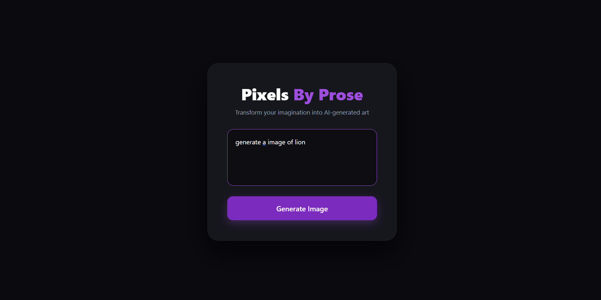

# Pixels By Prose: AI Art Generator

Pixels By Prose is a full-stack generative AI application that transforms natural language prompts into high-quality digital art using Latent Diffusion Models. The project features a custom-built web interface and a high-performance FastAPI backend optimized for stable diffusion inference.

---

## Project Preview

<p align="center">
  
  <br>
  <em>Custom Dark-Mode UI designed for an immersive creative experience.</em>
</p>

<p align="center">
  
  <br>
  <em>An example of an Arcane-style portrait generated from a text prompt.</em>
</p>

---

## Core Features
* **Latent Diffusion Integration**: Leverages the `nitrosocke/Arcane-Diffusion` model for stylized artistic generations.
* **Optimized Inference**: Utilizes PyTorch 2.6 with attention slicing to manage VRAM efficiency on consumer hardware.
* **Real-time API**: Powered by a FastAPI server that handles asynchronous image processing and byte streaming.
* **Responsive Frontend**: A clean, "glassmorphism" styled UI built with modern CSS and Vanilla JavaScript.

---

## Technical Architecture


* **Frontend**: HTML5, CSS3 (Custom Variables), JavaScript (Fetch API).
* **Backend**: FastAPI (Python 3.12).
* **AI Model**: Stable Diffusion (Arcane-Diffusion fine-tune).
* **Machine Learning**: PyTorch 2.6, Hugging Face Diffusers.
* **Hardware Support**: Automatic CUDA/CPU detection for cross-platform compatibility.

---

## Installation and Setup

### 1. Backend Configuration
Ensure you have an NVIDIA GPU for optimal performance, or the system will default to CPU mode. Navigate to the backend directory and install:
```bash
pip install fastapi uvicorn diffusers torch transformers accelerate
python main.py